# UX Design Specification VaultBot

**Author:** Pavan
**Date:** 2026-01-30

---

## Executive Summary

### Project Vision
**"The Memory Prosthetic"**
VaultBot is a "Zero-UI" knowledge management tool that lives entirely within WhatsApp. It shifts the paradigm from "Active Organization" (having to open an app and file things) to "Passive Ingestion" (just forwarding a message). The goal is to reduce capture friction to near zero, solving the problem of "Write-Only Memory" where users save links but never look at them again.

### Target Users
**The "Busy Curator" (Primary)**
*   **Persona:** Ananya (Social) & Rohan (Planner).
*   **Behavior:** Captures content impulsively in group chats (Reels, Links).
*   **Constraint:** Will not install new apps or fill out metadata forms. Expects the "Agent" to do the work.
*   **Need:** Immediate "offloading" of mental load ("I saved this, I'm safe") and effortless retrieval later.

### Key Design Challenges
1.  **The "Black Box" Problem:** Since there is no UI, how do we confirm *what* the system "saw"? (e.g., Did it see the Jazz Bar or just a generic link?).
2.  **Search Blindness:** Without a visual interface, users may forget what they have stored or what commands are available.
3.  **Error Handling in Chat:** Handling failure modes (e.g., Private Links) without disrupting the flow of a group conversation.

## Core User Experience

### Defining Experience
**The "Impulse Loop" (Dual Context)**
The core user action is **Forwarding to VaultBot**. This behaves differently based on context:
1.  **DM (Personal Memory):** "Fire and Forget." Every forwarded item is auto-saved. Friction is zero.
2.  **Group (Shared Memory):** "Explicit Capture." Users must **Tag (@VaultBot)** to save. This prevents privacy leaks and spam.

This distinction ensures privacy in group settings while maintaining speed in personal curation.

### Platform Strategy
*   **Primary Platform:** WhatsApp (Mobile).
*   **Constraints:** Small touch targets, linear chat history, limited formatting (Markdown).
*   **Interaction Model:** Primarily **Taps** (Share Sheet) for ingestion, and **Commands** (`/search`) for retrieval.

### Effortless Interactions
*   **Auto-Cleaning:** System automatically strips tracking parameters from links.
*   **Smart Auto-Tagging:** System infers "Food", "Travel", "Code" tags from content analysis.
*   **Contextual Help:** A `/help` command instantly returns a concise "Cheat Sheet" of capabilities, solving the "Search Blindness" problem.

### Critical Success Moments
**The "Visual Unfurl"**
When a user searches (e.g., `/search jazz`), the pivotal moment is receiving a **Rich Media Card** (Thumbnail + Title + Vibe) rather than a blue link. This visual feedback confirms the system "understood" the content, building trust.

### Experience Principles
1.  **Capture Speed > Accuracy:** Better to save a messy link instantly than ask for clarification.
2.  **Privacy First:** In shared spaces (Groups), consent is explicit (Tagging). In private spaces (DM), convenience is king (Auto-save).
3.  **Visual First:** Retrieval results must be visual to differentiate VaultBot from a standard chat search.
## Desired Emotional Response

### Primary Emotional Goals
*   **Relief ("Offloading"):** The immediate lifting of mental weight ("I don't have to remember this").
*   **Confidence ("Trust"):** Certainty that the system captured the *right* thing, reinforced by visual confirmation.
*   **Delight ("Surprise"):** The "magic" moment when messy links become beautiful, organized cards.

### Emotional Journey Mapping
1.  **Ingestion:** Stress/Hurry -> *Action (Forward)* -> **Relief (✅)**.
2.  **Retrieval:** Forgetfulness/Panic -> *Action (/search)* -> **Mastery (Found it!)**.

### Micro-Emotions
*   **Smart vs. Stupid:** If the bot says "I don't understand," the user feels the bot is stupid. If it says "Saved link" (even if extraction was partial), the user feels smart/safe. **Prioritize "Saved" over "Error".**
*   **Intimate vs. Corporate:** The bot uses emojis (📝, 📍) instead of formal text. It feels like a personal utility, not a corporate service.

### Design Implications
*   **Relief:** Speed is the #1 design constraint. No loading spinners.
*   **Confidence:** Always show a "Snapshot" of what was saved.
*   **Delight:** Unfurl rich media cards that look better than the original link.

### Emotional Design Principles
1.  **Forgiveness:** The system accepts messy input and cleans it up without complaint.
2.  **Visual Confirmation:** Seeing is believing. Text confirmation is insufficient for trust.
## UX Pattern Analysis & Inspiration

### Inspiring Products Analysis
*   **Pocket / Instapaper:** Mastery of "Read Later" simplicity. Key takeaway: One-click save, distraction-free reading.
*   **Telegram Saved Messages:** The widespread habit of "forwarding to self". Key takeaway: Leverage existing habits.
*   **Pinterest:** Visual bookmarking. Key takeaway: The "Card" layout involves the user; a list of links ignores them.

### Transferable UX Patterns
*   **"The Share Sheet":** Leveraging the native OS share sheet -> WhatsApp. Zero new habits.
*   **"The Unfurl":** Replacing raw links with rich media previews (like Discord/Slack).
*   **"Slash Commands" (MVP):** Explicit commands:
    *   `/search` - Retrieval.
    *   `/pause` - Stop saving (Privacy).
    *   `/resume` - Resume saving.
*   **"The Tag" (Group Context):** Using `@VaultBot` as the explicit "Save" trigger in groups.
*   **"Natural Language Querying" (Future):** Moving to "Show me pizza places" as the AI gets smarter, catering to non-technical users who don't 'speak dev'.

### Anti-Patterns to Avoid
*   **"The Conversationalist":** Bots that try to chat or say "How are you?". VaultBot is a utility.
*   **"The Link Dump":** Returning a list of blue hyperlinks. Results must be visual cards.

## Design System Foundation

### 1.1 Design System Choice
**Native Chat UI (WhatsApp-First)**
Since VaultBot lives entirely within WhatsApp, we do not control the pixel-level UI. Instead, we control the **Presentation Layer** using native chat primitives.

### Rationale for Selection
*   **Zero Friction:** The user never leaves the app. It feels like a native feature of WhatsApp, not an external tool.
*   **Performance:** Zero latency; no webviews to load.
*   **Accessibility:** Automatically inherits WhatsApp's font scaling, dark mode, and screen reader support.

### Implementation Approach
*   **Dynamic Card Generation:** We will build a backend service to generate "OpenGraph" images on the fly. When the bot replies with a result, it will trigger a link preview that displays our custom-generated "Card" (visualizing the data) rather than a generic website preview.
*   **Emoji Lexicon:** We will define a strict set of emojis to communicate status, replacing text-heavy system messages (e.g., ⏳ = Processing, ✅ = Saved, ❌ = Failed).

### Customization Strategy
*   **Markdown Formatting:** Strict use of **Bold**, *Italic*, and `Monospace` to create hierarchy within text bubbles.
## Detailed Interaction Mechanics

### Defining Experience: "The Forward"
The core interaction is the **Forward**. Unlike a typical app where you "Open App -> Paste Link", here the user "Shares" from the source. The mental model is **"Texting my Assistant"**. Users treat the bot like a contact.

### User Mental Model
*   **"Fire and Forget":** The user expects to send the message and immediately return to their previous context (Instagram/TikTok). They do not wait for a confirmation reply.
*   **"The Black Hole Fear":** The biggest friction is trusting that the "Black Hole" (the chat) actually caught the item.

### Success Criteria
*   **No Flow Break:** The user must be able to save content without breaking their scroll flow.
*   **Implicit Confirmation:** The "Double Tick" (WhatsApp Delivered) + "Blue Tick" (Read) is the first layer of trust. The "Emoji Reaction" is the second.

### Novel UX Patterns
**"The Asynchronous Notification"**
Unlike a search engine where you wait for results, here you "Fire and Forget". The bot notifies you *only* when it has added value (e.g., "Found the price: $20"), using the **Passive Push** pattern.

### Experience Mechanics (The Flow)
1.  **Initiation:** User hits "Share" on Instagram -> Selects "WhatsApp" -> Selects "VaultBot".
2.  **Interaction:** User hits "Send". No caption needed.
3.  **Feedback (The Trust Loop):**
    *   *Immediate:* WhatsApp shows "Sent" tick (Native).
    *   *Async (<2s):* Bot reacts with 📝 emoji (Receipt).
    *   *Async (<5s):* Bot replies with ⚡️ (or specific result card) if processing/unfurling is successful.
## Visual Design Foundation (The Card System)

### Card Canvas Strategy
Since the Chat UI is immutable, our entire visual identity lives in the **Generated OpenGraph Cards**.
*   **Aspect Ratio:** 1.91:1 (Landscape) for standard links, 1:1 (Square) for Instagram/TikTok highlights.
*   **Theme:** "Dark Mode First" to align with the most common WhatsApp usage environment.

### Typography System
*   **Typeface:** `Inter` or `San Francisco` (System Fonts). We prioritize legibility at small sizes over brand uniqueness.
*   **Hierarchy:**
    *   **Title:** Bold, High Contrast (White, 16px).
    *   **Metadata:** Medium, Lower Contrast (Gray, 12px) for "Address", "Date".
    *   **Vibe Tags:** Colored Badges (Pill shape, 10px, Bold).

### Semantic Color System
*   **Dynamic Backgrounds:** The card background adapts to the dominant color of the saved content (Spotify-style), creating a dedicated "Look" for each item.
*   **Status Indicators:**
    *   🟢 **Green:** Price / Value / Open Now.
    *   🟡 **Yellow:** Rating / Stars.
    *   🟣 **Purple:** "Vibe" / Mood / Category.

### Layout Principles
*   **Density:** Maximize information density. A 300px card must convey What, Where, and How Much at a glance.
## Design Direction Decision

### Chosen Direction
**"The Index Card" (Utility First)**

### Design Rationale
*   **Persona Alignment:** Ananya and Rohan (The "Planners") value **retrievability** over aesthetics. They want to know "Where is this?" and "How much?" instantly.
*   **Trust Factor:** A clean, data-dense layout feels more "reliable" (like a system utility) than a flashy magazine layout.
*   **Legibility:** Establishing a strict grid ensures that metadata (Date, Price, Tags) is always in the same place, building muscle memory.

### Implementation Approach
*   **Layout:** Split View (Landscape Card).
    *   **Left (30%):** Square Thumbnail (Object-fit: Cover).
    *   **Right (70%):** Data Grid.
*   **Typography:** High-contrast `Inter`.
    *   **Header:** White, Bold (2 lines max).
    *   **Meta Row:** Gray icon + White text (e.g., 📍 *Soho, NYC*).
    *   **Footer:** Colored "Pill" tags for status.
## User Journey Flows

### Flow 1: Ingestion (Dual Context)
 

### Flow 1.1: Privacy Control (DM Only)
User can pause capturing to have a private conversation with the LLM or just stop logging.

```mermaid
sequenceDiagram
    participant User
    participant VaultBot
    
    User->>VaultBot: /pause
    VaultBot-->>User: "⏸️ Paused. I won't save messages."
    User->>VaultBot: [Sends Links/Text]
    VaultBot->>VaultBot: Ignore
    User->>VaultBot: /resume
    VaultBot-->>User: "▶️ Resumed. Listening..."
```

### Flow 2: Retrieval (Unified vs Isolated)
Based on context:

### Flow 3: The "Help" Loop
Solving "Feature Blindness".

### Flow Optimization Principles
*   **Optimistic "Read" Status:** We mark the message as read immediately via API to tell the user "We got it".
## Component Strategy

### Design System Components (Native)
We rely on WhatsApp's native client for the interaction layer:
*   **Text Bubble:** Markdown-formatted text for brief acknowledgments.
*   **Reaction:** The primary status indicator (✅, ❌).
*   **Image Message:** Static images used for the "Cheat Sheet".

### Custom Components (Generated Cards)
These are images dynamically generated by our backend node service (`canvas`/`satori`) and served via OpenGraph meta tags.

**1. The Universal Card (Link Preview)**
*   **Purpose:** Fallback for generic articles/links.
*   **Structure:**
    *   *Left (30%):* Thumbnail.
    *   *Top Right:* Title (Truncated 2 lines, Bold, White).
    *   *Bottom Right:* Domain + Date.
    *   *Footer:* "👤 Saved by [Name]" (If Group Context).

**2. The "Place" Card (Maps/Food)**
*   **Purpose:** Richer context for physical locations.
*   **Extras:** Star Rating (⭐️ 4.5), Price ($$$), "Open Now" badge (Green Pill).

**3. The "Video" Card (YouTube/Instagram)**
*   **Purpose:** Highlights multimedia content.
*   **Structure:** Square aspect ratio. Thumbnail has a semi-transparent "Play" overlay. Metadata includes Duration (10:02) and Channel Name.

**4. The "Cheat Sheet" (Help)**
*   **Purpose:** Instant onboarding.
*   **Format:** A single, high-contrast infographic image showing command examples (`/search`, `/tag`) in a visual grid.

### Component Implementation Strategy
*   **Generation Engine:** Node.js service using `satori` (Vercel) to convert HTML/CSS templates into SVG/PNG.
## UX Consistency Patterns

### Interaction Patterns
*   **"Slash" vs "Natural":**
    *   **Slash Commands (`/search`):** Used for precise, structured intent (Power Users).
    *   **Natural Language ("find info on..."):** Supported for loose, exploratory intent.
*   **The Share Sheet:** The primary ingestion trigger. Any text shared to the bot is treated as an implicit "Save" command.

### Feedback Patterns (The Emoji System)
We replace system text with emojis to reduce noise:
*   📝 (Memo): **Ack** - "Message received, processing."
*   ⏳ (Hourglass): **Working** - "Downloading video/generating card."
*   ✅ (Check): **Success** - "Saved and indexed."
*   ⚠️ (Warning): **Partial Success** - "Saved as Raw Link (Metadata failed)."
*   ❌ (X): **Failure** - System Error. (Rarely used).

### Error Recovery (Graceful Fallback)
*   **Principle:** "Save Everything."
*   **Scenario:** User sends a broken link or unsupported content.
## Responsive Design & Accessibility

### Responsive Strategy (The "Card" Viewport)
*   **Constraint:** OpenGraph images are static. We cannot change layout based on device size.
*   **Safe Zones:** We design cards with a **Central Safe Zone** to ensure critical text isn't cropped on smaller screens (iPhone SE) or zoomed interfaces. Content must be centered or have adequate padding.

### Accessibility Strategy (The Blind Spot)
*   **Problem:** WhatsApp does NOT support Alt Text for OpenGraph Link Previews automatically.
*   **Solution: The "Caption Fallback".** Every time we send a Card, we *must* append a text caption that duplicates the critical info (e.g., "Review of Joe's Pizza - 4 Stars") so screen readers can access it to ensure WCAG AA compliance.

### Dark Mode Compliance
*   **Strategy:** Cards are **Dark Mode First** (Gray `#1E1E1E`) because they look good on both Light and Dark WhatsApp themes. A White card on Dark Mode creates harsh contrast and looks "broken".
